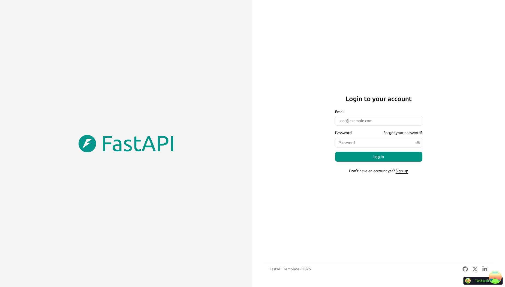
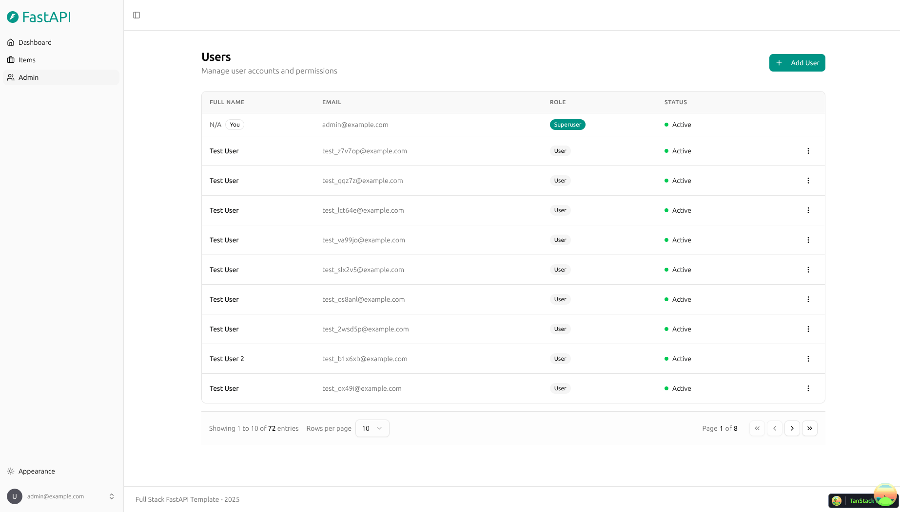
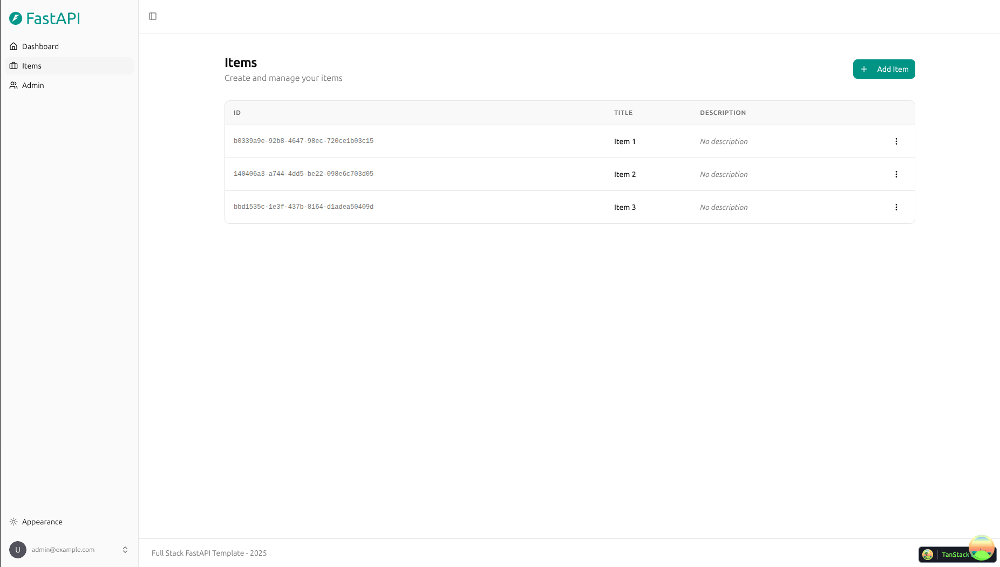
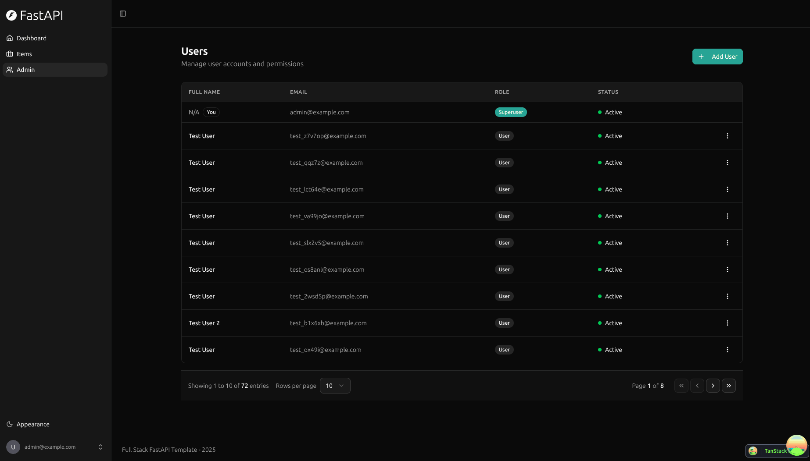
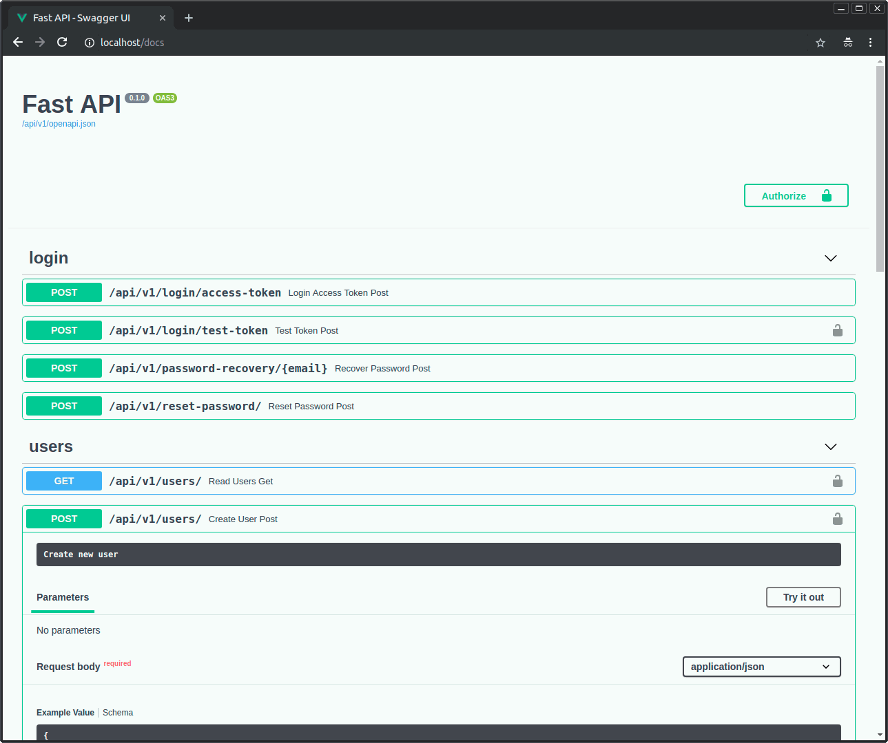

# Full Stack FastAPI Template

<a href="https://github.com/fastapi/full-stack-fastapi-template/actions?query=workflow%3A%22Test+Docker+Compose%22" target="_blank"></a>
<a href="https://github.com/fastapi/full-stack-fastapi-template/actions?query=workflow%3A%22Test+Backend%22" target="_blank"></a>
<a href="https://coverage-badge.samuelcolvin.workers.dev/redirect/fastapi/full-stack-fastapi-template" target="_blank"></a>

A production-ready template for building full stack web applications with a FastAPI backend and a React frontend, wired together with Docker Compose for local development and deployment.

## Technology Stack and Features

- **FastAPI** for the Python backend API.
  - [SQLModel](https://sqlmodel.tiangolo.com) for SQL database interactions (ORM).
  - [Pydantic](https://docs.pydantic.dev), used by FastAPI, for data validation and settings management.
  - [PostgreSQL](https://www.postgresql.org) as the SQL database.
- **React** for the frontend.
  - TypeScript, hooks, [Vite](https://vitejs.dev), and other parts of a modern frontend stack.
  - [Tailwind CSS](https://tailwindcss.com) and [shadcn/ui](https://ui.shadcn.com) for frontend components.
  - An automatically generated frontend client.
  - [Playwright](https://playwright.dev) for end-to-end testing.
  - Dark mode support.
- **Docker Compose** for development and production.
- Secure password hashing by default.
- JWT (JSON Web Token) authentication.
- Email-based password recovery.
- [Mailcatcher](https://mailcatcher.me) for local email testing during development.
- Tests with [Pytest](https://pytest.org).
- [Traefik](https://traefik.io) as a reverse proxy / load balancer.
- Deployment instructions using Docker Compose, including how to set up a frontend Traefik proxy to handle automatic HTTPS certificates.
- CI (continuous integration) and CD (continuous deployment) based on GitHub Actions.

## Screenshots

<table>
  <tr>
    <td align="center" width="50%">
      <a href="https://github.com/fastapi/full-stack-fastapi-template">
        
      </a>
      <br>
      <sub><b>Dashboard Login</b></sub>
    </td>
    <td align="center" width="50%">
      <a href="https://github.com/fastapi/full-stack-fastapi-template">
        
      </a>
      <br>
      <sub><b>Dashboard - Admin</b></sub>
    </td>
  </tr>
  <tr>
    <td align="center" width="50%">
      <a href="https://github.com/fastapi/full-stack-fastapi-template">
        
      </a>
      <br>
      <sub><b>Dashboard - Items</b></sub>
    </td>
    <td align="center" width="50%">
      <a href="https://github.com/fastapi/full-stack-fastapi-template">
        
      </a>
      <br>
      <sub><b>Dashboard - Dark Mode</b></sub>
    </td>
  </tr>
</table>

### Interactive API Documentation

[](https://github.com/fastapi/full-stack-fastapi-template)

## Getting Started

You can fork or clone this repository and use it as is. It works out of the box.

### Using a Private Repository

If you want a private repository, GitHub won't let you simply fork this one, since it doesn't allow changing the visibility of forks. Instead:

1. Create a new GitHub repository, for example `my-full-stack`.
2. Clone this repository manually, naming the local directory after your project:

   ```bash
   git clone git@github.com:fastapi/full-stack-fastapi-template.git my-full-stack
   ```

3. Enter the new directory:

   ```bash
   cd my-full-stack
   ```

4. Point `origin` at your new repository (copy the URL from the GitHub interface):

   ```bash
   git remote set-url origin git@github.com:octocat/my-full-stack.git
   ```

5. Add this repository as an `upstream` remote so you can pull in updates later:

   ```bash
   git remote add upstream git@github.com:fastapi/full-stack-fastapi-template.git
   ```

6. Push the code to your new repository:

   ```bash
   git push -u origin master
   ```

### Updating from the Original Template

After cloning the repository and making changes, you may want to pull in the latest updates from this template.

1. Make sure you've added the original repository as a remote (see above). Verify with:

   ```bash
   git remote -v

   origin      git@github.com:octocat/my-full-stack.git (fetch)
   origin      git@github.com:octocat/my-full-stack.git (push)
   upstream    git@github.com:fastapi/full-stack-fastapi-template.git (fetch)
   upstream    git@github.com:fastapi/full-stack-fastapi-template.git (push)
   ```

2. Pull the latest changes without merging:

   ```bash
   git pull --no-commit upstream master
   ```

   This downloads the latest changes without committing them, so you can review everything before committing.

3. Resolve any conflicts in your editor.
4. Once you're done, commit the changes:

   ```bash
   git merge --continue
   ```

### Configuration

Update the values in the `.env` files to match your configuration.

Before deploying, make sure you change at least:

- `SECRET_KEY`
- `FIRST_SUPERUSER_PASSWORD`
- `POSTGRES_PASSWORD`

These should be passed as environment variables from a secrets manager rather than committed to the repository.

See [deployment.md](./deployment.md) for details.

### Generating Secret Keys

Some environment variables in the `.env` file default to `changethis`. Replace them with secure, randomly generated keys:

```bash
python -c "import secrets; print(secrets.token_urlsafe(32))"
```

Copy the output and use it as your password or secret key. Run the command again for each key you need to generate.

## Alternative: Generating a Project with Copier

This repository also supports generating a new project using [Copier](https://copier.readthedocs.io), which copies all files, asks configuration questions, and updates your `.env` files with the answers.

### Install Copier

```bash
pip install copier
```

Or, if you have [`pipx`](https://pipx.pypa.io/) installed:

```bash
pipx install copier
```

> **Note:** With `pipx`, installing Copier as a standalone tool is optional. You can run it directly instead.

### Generate a Project

Choose a name for your project's directory, for example `my-awesome-project`. From the parent directory, run:

```bash
copier copy https://github.com/fastapi/full-stack-fastapi-template my-awesome-project --trust
```

If you have `pipx` but haven't installed Copier separately, you can run it directly:

```bash
pipx run copier copy https://github.com/fastapi/full-stack-fastapi-template my-awesome-project --trust
```

> **Note:** The `--trust` option is required to run a [post-creation script](https://github.com/fastapi/full-stack-fastapi-template/blob/master/.copier/update_dotenv.py) that updates your `.env` files.

### Input Variables

Copier will prompt for the following values. Defaults are shown below, and everything can be edited afterward in the `.env` files.

| Variable | Default | Description |
| --- | --- | --- |
| `project_name` | `FastAPI Project` | Name of the project, shown to API users. |
| `stack_name` | `fastapi-project` | Stack name used for Docker Compose labels and the project name (no spaces or periods). |
| `secret_key` | `changethis` | Secret key used for security; generate one with the command above. |
| `first_superuser` | `admin@example.com` | Email of the first superuser. |
| `first_superuser_password` | `changethis` | Password of the first superuser. |
| `smtp_host` | *(empty)* | SMTP server host for sending emails; can be set later in `.env`. |
| `smtp_user` | *(empty)* | SMTP server user for sending emails; can be set later in `.env`. |
| `smtp_password` | *(empty)* | SMTP server password for sending emails; can be set later in `.env`. |
| `emails_from_email` | `info@example.com` | Email account emails are sent from; can be set later in `.env`. |
| `postgres_password` | `changethis` | Password for the PostgreSQL database; generate one with the command above. |
| `sentry_dsn` | *(empty)* | DSN for Sentry, if used; can be set later in `.env`. |

## Documentation

- [Backend development](./backend/README.md)
- [Frontend development](./frontend/README.md)
- [Deployment](./deployment.md)
- [Development](./development.md): Docker Compose, custom local domains, `.env` configuration, and more.
- [Release notes](./release-notes.md)

## License

The Full Stack FastAPI Template is licensed under the terms of the MIT license.
